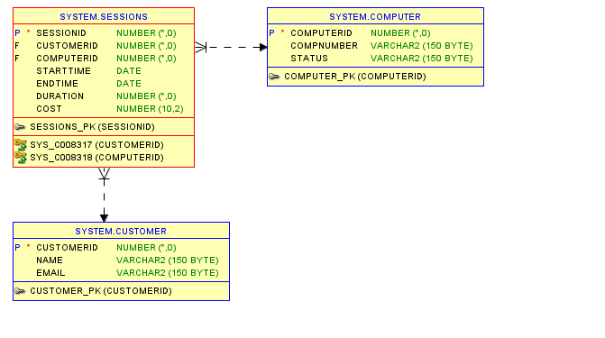

# Agricultural Management System 

This README provides an overview of the **Farmer and Crop Management System**, designed to manage information related to farmers, fields, crops, sales, and customers. The system includes tables for Farmers, Fields, Crops, Sales, and Customers, supporting efficient tracking of crop production and sales management.

## Table Structures

### 1. Farmers Table
The `Farmers` table stores information about farmers, including their contact details, role, hire date, and salary.

```sql
CREATE TABLE FARMERS(
FARMERID NUMBER PRIMARY KEY,
NAME VARCHAR(150),
CONTACT INT,
ROLE VARCHAR(200),
HIREDATE DATE,SALARY int
```
);

### Sales Table
```sql
CREATE TABLE SALES (
SALEID NUMBER PRIMARY KEY,
QUANTITY NUMBER,
SALEDATE DATE,
TOTALAMOUNT NUMBER
```
);

### FIELDS TABLE
```sql
CREATE TABLE FIELDS 
( FIELDID NUMBER PRIMARY KEY,
FIELDNAME VARCHAR(200),
FIELD_SIZE INT, LOCATION VARCHAR(200),
SOILTYPE VARCHAR(200)
```
);
### CROPS TABLE
```sql
CREATE TABLE CROPS (
CROPID NUMBER PRIMARY KEY,
CROPNAME VARCHAR(100),
PLANTING_DATE DATE,
HARVEST_DATE DATE,
YIELD VARCHAR(200),
FIELDID NUMBER,
FOREIGN KEY (FIELDID) REFERENCES FIELDS(FIELDID)
```
);
### CUSTOMERS table
```sql
CREATE TABLE CUSTOMERS
 (CUSTOMERID NUMBER PRIMARY KEY,
CUSTOMER_NAME VARCHAR(200),
CONTACT NUMBER,
ADDRESS VARCHAR(200)
```
);
### alter tables adding the colums and foreign key constraint
```sql
ALTER TABLE SALES ADD CUSTOMERID NUMBER;
COMMIT;
ALTER TABLE SALES ADD CROPID NUMBER;
COMMIT;
ALTER TABLE SALES ADD FOREIGN KEY (CUSTOMERID) REFERENCES CUSTOMERS(CUSTOMERID);
COMMIT;
ALTER TABLE SALES ADD FOREIGN KEY (CROPID) REFERENCES CROPS(CROPID)
```
;
COMMIT;
### inserting into farmers
```sql
INSERT INTO FARMERS VALUES( 1,'KALISA',0788888888,'MANAGER',TO_DATE('12-12-2023','DD-MM-YYYY'),200000);
INSERT INTO FARMERS VALUES( 3,'LISA',078888,'MANAGER',TO_DATE('12-12-2023','DD-MM-YYYY'),200);
INSERT INTO FARMERS VALUES( 2398,'KAMALIZA',0798765432,'TRADER',TO_DATE('20-02-2021','DD-MM-YYYY'),150000);
COMMIT
```
;
### inserting into fields
```sql
INSERT INTO FIELDS VALUES( 309,'AMAHORO',20,'HUYE','CLAY');
INSERT INTO FIELDS VALUES( 209,'HINGA WEZA',36,'KAYONZA','LOAMY');
INSERT INTO FIELDS VALUES( 109,'RAMIRO',17,'BUGESERA','SANDY')
```
;
### inserting into crops
```sql
INSERT INTO CROPS VALUES ( 11,'MUSHROOM',TO_DATE('30-09-2022','DD-MM-YYYY'),TO_DATE('27-12-2022','DD-MM-YYYY'),'150KG',109);
INSERT INTO CROPS VALUES ( 22,'SWEET_POTATOES',TO_DATE('24-07-2021','DD-MM-YYYY'),TO_DATE('18-06-2022','DD-MM-YYYY'),'300KG',309);
INSERT INTO CROPS VALUES ( 33,'BEANS',TO_DATE('20-02-2021','DD-MM-YYYY'),TO_DATE('29-03-2022','DD-MM-YYYY'),'400KG',209);
INSERT INTO CROPS VALUES ( 30,'BEANS',TO_DATE('20-02-2021','DD-MM-YYYY'),TO_DATE('29-03-2022','DD-MM-YYYY'),'400KG',209);
```
;

### select,update and delete comands
```sql
SELECT * FROM CROPS WHERE CROPID = 33;
COMMIT;
UPDATE CROPS SET CROPNAME='FRUITS' WHERE CROPID=33;
COMMIT;
DELETE FROM FARMERS WHERE NAME='LISA';
COMMIT;
```
;
## CONCEPTUAL DIAGRAM

## QUERY

## QUERY


### query and output
```sql


```
;
